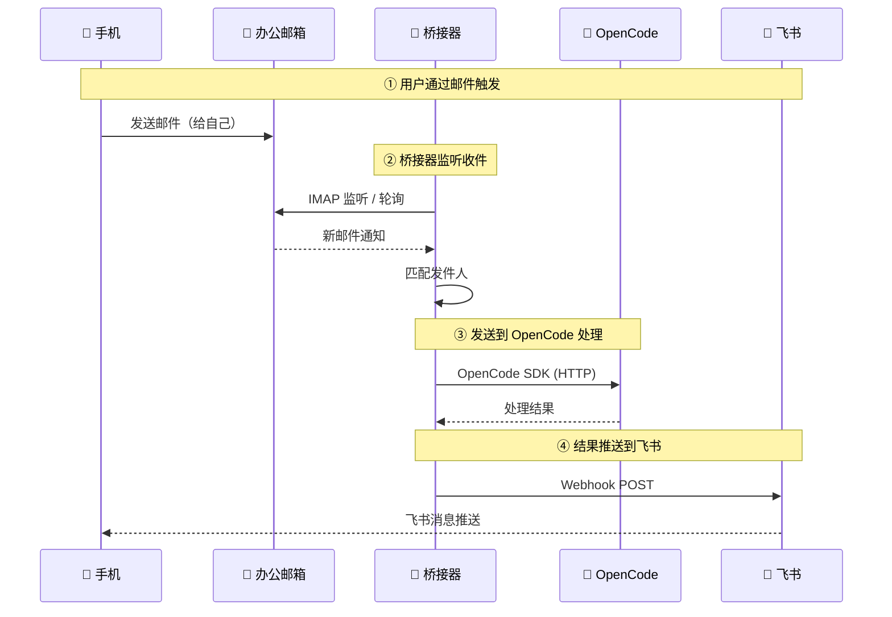

# Email-OpenCode-飞书桥接器

将指定发件人的邮件自动发送到 **OpenCode AI** 进行处理，并通过 **飞书 Webhook** 推送处理结果。

## 本项目的初衷

我猜可能很多人会疑惑，要操作自己电脑上的 **OpenCode** 为什么需要这么一个“蹩脚”的方案，又是发邮件，又是发飞书的，直接用不就好了吗！如果你有这样的疑惑很正常，下面我来解释一下子。

首先，我的需求其实是想用我的手机就可以远程操作我的办公电脑，我的办公电脑出于一个比较特殊的网络环境中，为了安全考虑，很多权限约束，所以常规的远程软件肯定是不能用的，比如：happy coder，它可以用手机直接操控电脑上的 Claude Code。其它的什么向日葵、Teamviewer之类的就更不可能用。

公司的邮箱和飞书各有各的限制，邮箱限制外发，飞书的机器人也只能使用Webhook这样的单向给群聊发消息的。

综合上述情况，我的方案就是用手机在办公邮箱自己给自己发邮件，这样我这个桥接器就能通过监听邮箱的收件功能来触发事件，利用OpenCode SDK与OpenCode通信，收到OpenCode的回复之后又通过飞书的Webhook发送消息，这样就实现了手机与 OpenCode 的通信。OpenCode作为一个大模型的客户端，其实能做挺多事情的，大家可以自由发挥。

## 通信架构



## 功能

- **IMAP 邮件监控** — 实时监听指定发件人的新邮件（支持 IMAP IDLE 推送 + 30 秒轮询兜底）
- **OpenCode AI 集成** — 收到邮件后自动发送到本地 OpenCode 服务进行处理
- **飞书通知** — OpenCode 处理结果通过飞书机器人 Webhook 推送
- **运行日志** — 内置日志面板，支持日志文件持久化

---

## 目录

- [安装与运行](#安装与运行)
- [邮件配置（IMAP）](#邮件配置imap)
  - [QQ邮箱 获取应用密码](#qq邮箱-获取应用密码)
  - [163邮箱 获取应用密码](#163邮箱-获取应用密码)
  - [Gmail 获取应用密码](#gmail-获取应用密码)
- [OpenCode 配置](#opencode-配置)
  - [OpenCode 自身设置](#opencode-自身设置)
- [飞书设置](#飞书设置)
  - [飞书 Webhook 创建步骤](#飞书-webhook-创建步骤)
- [本软件设置说明](#本软件设置说明)
- [构建安装包](#构建安装包)

---

## 安装与运行

### 环境要求

- Node.js >= 20
- pnpm（安装：`npm install -g pnpm`）

### 开发运行

```bash
pnpm install
pnpm dev
```

启动后会出现 Electron 窗口，Vite 支持热更新（HMR），修改代码后自动刷新。

---

## 邮件配置（IMAP）

本软件通过 IMAP 协议连接邮箱服务器，读取指定发件人的新邮件。

### 配置参数

| 参数 | 说明 |
|------|------|
| IMAP 服务器 | 邮箱的 IMAP 地址（如 `imap.qq.com`） |
| 端口 | 默认 993（TLS）或 143（非 TLS） |
| 使用 TLS | 是否使用 SSL/TLS 加密连接 |
| 用户名 | 邮箱完整地址 |
| 密码 | 邮箱密码 / 授权码（视邮箱服务商要求而定） |
| 监控发件人 | 要监听的发件人邮箱地址列表 |
| 匹配方式 | `精确匹配` = 完全匹配邮箱地址，`域名匹配` = 匹配 @ 后面的域名 |

> **密码说明**：不同邮箱服务商要求不同，本程序直接透传密码到 IMAP 服务器，兼容两种方式：
> - QQ邮箱、163邮箱、Gmail 等**需要**应用专用密码/授权码
> - Outlook/Hotmail、自建 IMAP 服务器等**可直接**使用登录密码
> - 请按你的邮箱服务商要求填写即可。
>
> 下面列出了常见邮箱的密码获取方法。

### QQ邮箱 获取应用密码

1. 登录 [QQ邮箱](https://mail.qq.com/)
2. 点击顶部「设置」→「帐户」
3. 找到 **POP3/IMAP/SMTP/Exchange/CardDAV/CalDAV服务**
4. 开启 **IMAP/SMTP服务**（如果未开启）
5. 点击「生成授权码」→ 按指引发送短信
6. 生成的 **授权码** 即为本软件所需的密码
7. IMAP 服务器：`imap.qq.com`，端口 `993`，TLS 开启

### 163邮箱 获取应用密码

1. 登录 [163邮箱](https://mail.163.com/)
2. 点击顶部「设置」→「POP3/SMTP/IMAP」
3. 开启 **IMAP/SMTP服务**
4. 点击「新增授权密码」→ 按指引操作
5. 生成的授权密码即为本软件所需的密码
6. IMAP 服务器：`imap.163.com`，端口 `993`，TLS 开启

### Gmail 获取应用密码

1. 确保已开启 [两步验证](https://myaccount.google.com/security)
2. 访问 [Google 应用密码](https://myaccount.google.com/apppasswords)
3. 选择「邮件」和「Windows 计算机」→「生成」
4. 复制生成的 16 位应用密码
5. IMAP 服务器：`imap.gmail.com`，端口 `993`，TLS 开启

### Outlook / Hotmail

- IMAP 服务器：`outlook.office365.com`，端口 `993`，TLS 开启
- 可直接使用邮箱登录密码（建议开启两步验证后使用应用密码）

---

## OpenCode 配置

本软件收到邮件后会将邮件内容发送到本地运行的 OpenCode AI 服务进行处理。

### 配置参数

| 参数 | 说明 |
|------|------|
| OpenCode 地址 | OpenCode 服务地址，默认 `127.0.0.1` |
| 端口 | OpenCode 服务端口，默认 `4096` |

### OpenCode 自身设置

[OpenCode](https://github.com/opencode-ai) 是一个 AI 代码助手，支持以 HTTP 服务模式运行，在本地开启 API 端口供其他程序调用。

**启动 OpenCode 服务：**

```bash
# 使用 opencode CLI 启动服务模式
opencode serve --port 4096
```

启动后 OpenCode 会在 `http://127.0.0.1:4096` 监听请求。在本软件的设置页面中，点击「测试 OpenCode 连接」可以验证是否联通。

> 如果尚未安装 OpenCode，请参考 [OpenCode 官方文档](https://github.com/opencode-ai) 进行安装。

---

## 飞书设置

OpenCode 处理完邮件后，会通过飞书机器人 Webhook 将结果推送到飞书群聊。

### 飞书 Webhook 创建步骤

1. **打开飞书客户端**，进入目标群聊
2. **添加机器人**：
   - 点击群聊右上角的「…」→「设置」
   - 选择「群机器人」→「添加机器人」
   - 在机器人列表中找到 **Webhook 机器人** →「添加」
3. **配置 Webhook**：
   - 自定义机器人名称（如「邮件处理通知」）
   - 点击「完成」
4. **复制 Webhook 地址**：
   - 添加成功后会显示一个 Webhook URL
   - 格式类似：`https://open.feishu.cn/open-apis/bot/v2/hook/xxxx-xxxx-xxxx`
   - 复制此地址，粘贴到本软件的「飞书 Webhook 地址」字段

### 注意事项

- 飞书 Webhook 机器人默认所有群成员可见
- 如需限制使用范围，可在机器人设置中配置签名校验
- 本软件使用飞书 **post** 消息类型发送富文本消息
- 内置**频率控制**：每秒最多 1 次，每分钟最多 30 次，超出限制的消息自动排队等待

---

## 本软件设置说明

在软件左侧导航栏点击「设置」进入配置页面，所有配置分为五个区域：

### 1. IMAP 设置

| 字段 | 说明 |
|------|------|
| IMAP 服务器 | 邮箱的 IMAP 服务器地址（如 `imap.qq.com`） |
| 端口 | IMAP 端口，TLS 默认 `993`，非 TLS 默认 `143` |
| 使用 TLS | 是否启用 SSL/TLS 加密 |
| 用户名 | 邮箱完整地址 |
| 密码 | 邮箱的授权码 / 应用密码 |

### 2. 监控发件人

| 字段 | 说明 |
|------|------|
| 监控发件人 | 输入要监听的邮箱地址后按回车添加，支持多个 |
| 匹配方式 | `精确匹配` = 发件人地址必须完全一致；`域名匹配` = 只要域名匹配即触发（如填写 `example.com`，则所有来自 `@example.com` 的邮件都会触发） |

**发件人使用自己是一个不错的选择，自己给自己发邮件即可。**

设置完 IMAP 参数后可以点击 **「测试 IMAP 连接」** 按钮验证配置是否正确。

### 3. OpenCode 设置

| 字段 | 说明 |
|------|------|
| OpenCode 地址 | OpenCode 服务 IP（默认 `127.0.0.1`） |
| 端口 | OpenCode 服务端口（默认 `4096`） |

可点击 **「测试 OpenCode 连接」** 验证服务是否正常运行。

### 4. 飞书 Webhook 设置

| 字段 | 说明 |
|------|------|
| Webhook 地址 | 飞书机器人的 Webhook URL（格式：`https://open.feishu.cn/open-apis/bot/v2/hook/...`） |

**飞书可以创建一个只有自己一个人的群，然后创建一个群机器人即可。**

### 5. 日志设置

| 字段 | 说明 |
|------|------|
| 日志文件路径 | 可选。设置后运行日志会同时写入此文件（支持 `.log` 或 `.txt`） |

点击 **「浏览」** 按钮使用系统文件对话框选择保存路径。

### 保存

配置完成后点击 **「保存」** 按钮，系统会自动保存配置并重启邮件监控（如有旧配置会先停止旧引擎再启动新引擎）。

### 查看运行状态

配置保存后，在顶部栏点击 **「开始监控」** 即可启动邮件监听。顶部会显示监控状态（运行中/已连接/已断开），如果出现错误也会有提示。

IMAP 连接意外断开时会自动重连，重连采用指数退避策略（1s → 2s → 4s → ... → 最多 30s），每次重连都会创建新的 IMAP 连接实例。

---

## 数据存储位置

配置文件存储在 Electron 的 `userData` 目录中（不同操作系统路径不同）：

- **Windows**: `%APPDATA%/email-opencode-feishu-bridge/`
  - `email-config.json` — 邮箱与功能配置
  - `email-acks.json` — 已处理的邮件 UID 记录

---

## 构建安装包

```bash
pnpm build
```

构建产物位于 `release/` 目录，生成 Windows NSIS 安装程序。

---

## 许可

MIT License
